# 清扫机器人（新产品资料导入）

_来源目录：`清扫机器人`_

---

## PDF: Cleaning+Robot+Catalog

### Page 1

Clean Smarter, W o r k  Easier
Powerful, Modular, Easy to Maintain
 Cleaning Robot Catalog

### Page 2

Commercial Cleaning Robot
01.
02.
03.
•
For 100-1000㎡ cleaning
•
Scrubbing, vacuuming, mopping 
and sweeping
•
Compact design
C2
Flagship: Cost-Effective
•
For 1000-2000㎡ cleaning
•
Scrubbing, vacuuming and mopping
•
High cost performance
C2 Pro
Upgrade：Fully Automated
•
For 2000-10000㎡ cleaning
•
Scrubbing, vacuuming, mopping 
and sweeping
•
Automated water exchange and 
external water tank
C3 Mini
Compact: For Smaller Spaces

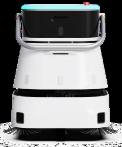

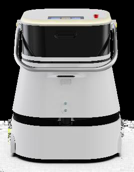

### Page 3

Pioneered Modular 
Commercial Cleaning Robot
Flagship: Cost-Effective — C2
For 1000 2 0 0 0 ㎡ Cleaning
C2  robot  integrates  scrubbing,  mopping  and 
vacuuming  with  self-recharging  and  self-cleaning.  It  is 
ideal for hospitals, shopping malls, campuses, exhibition 
halls, office buildings, terminals etc.
Smart
Cleaning
Online 
Upgrade
Modular 
Design

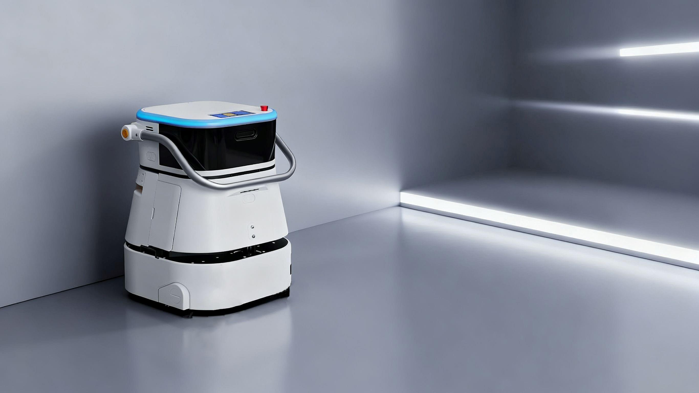

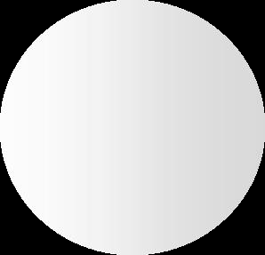

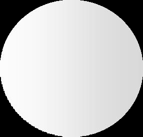

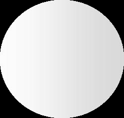

### Page 4

Powerful, Cost-Effective, Easy to Maintain
Partnerships
Recognized by industry players, our robots 
drive to corporations with leading companies.
Secured a 1000-unit order with one of the top 
cleaning companies.
Leading Shipment Volume
Distributed through channel networks to 
Europe, America, Japan, Korea, Australia, 
the Middle East, and Southeast Asia.
Market Leadership
Powerful Cleaning Performance
• Optimized structure design for multiple floor types and 
scenarios.
• Dry in 1 second with no residue.
Stabler and Safer
• Equipped with leading 3D navigation, our robots feature 
autonomous mapping, intelligent perception, and obstacle 
avoidance, ensuring safety and stability.
• Long market presence, with extensive global case studies and 
proven stable performance.
Modular Design, Minimizing Maintenance Costs
• Quick-release key components enables immediate maintenance with ease
even for non-specialists. Modules can be replaced.

### Page 5

Product Feature
Smart Route Planning
Autonomous mapping and iteration, automatic 
route planning, and real-time adjustment to
handle complex scenarios.
Autonomous Navigation
UAV–level multi-sensor navigation, 
intelligent obstacle avoidance, anti- 
collision, and anti-fall protection.
Scheduled Cleaning
Pre-set cleaning tasks, supporting 
multi-area combined cleaning.
Optimized Mechanism
Optimized  cleaning  structure  for 
multiple floor types and scenarios.
Dry in 1 second with no residue.
Adjustable Cleaning Intensity
Preset cleaning modes based on floor cleanliness,
effectively handling dust and heavy stains.
Cross-Area Cleaning
Supports autonomous elevator riding and continuous 
multi-floor cleaning.
Self-Cleaning
Continuously injects clean water during 
operation to rinse the roller brush.
Resume Cleaning
Automatically returns for charging 
when power is low and resumes 
cleaning from the stopped position.
Multiple Interaction Platform
Real-time voice prompts; task management via 
App, web-end software and onboard screen.
Remote Management
Cloud-based monitoring and early warning, remote 
task management, real-time data transmission and 
online upgrades.

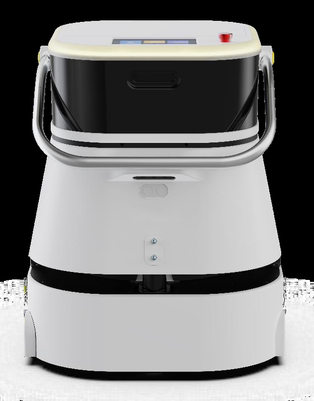

### Page 6

Specifications
Dimension
503*503*629mm
Weight
42KG
Sensor Configuration
2D LiDAR + High-Precision 6-axis IMU + Ultrasonic 
Radar + Structured Light Camera
IP Rate
IP34
Speed
0.1~0.8m/s, Adjustable
Tank Capacity
10L/10L
Cleaning width
440mm
Downward Pressure
20~40N
Cleaning efficiency
500-800㎡/h
Suction Power
20kPa Maximum
Battery
Lithium Iron Phosphate Battery, 25.6V 36AH
Duration
5-12h
Charging Time
3h
Communication
4G/Wi-Fi
Noise
≤65dB
Certification
FCC, CE, UKCA, CB, TELEC, JATE, UN38.3, etc.
On-premise Cloud
Optional

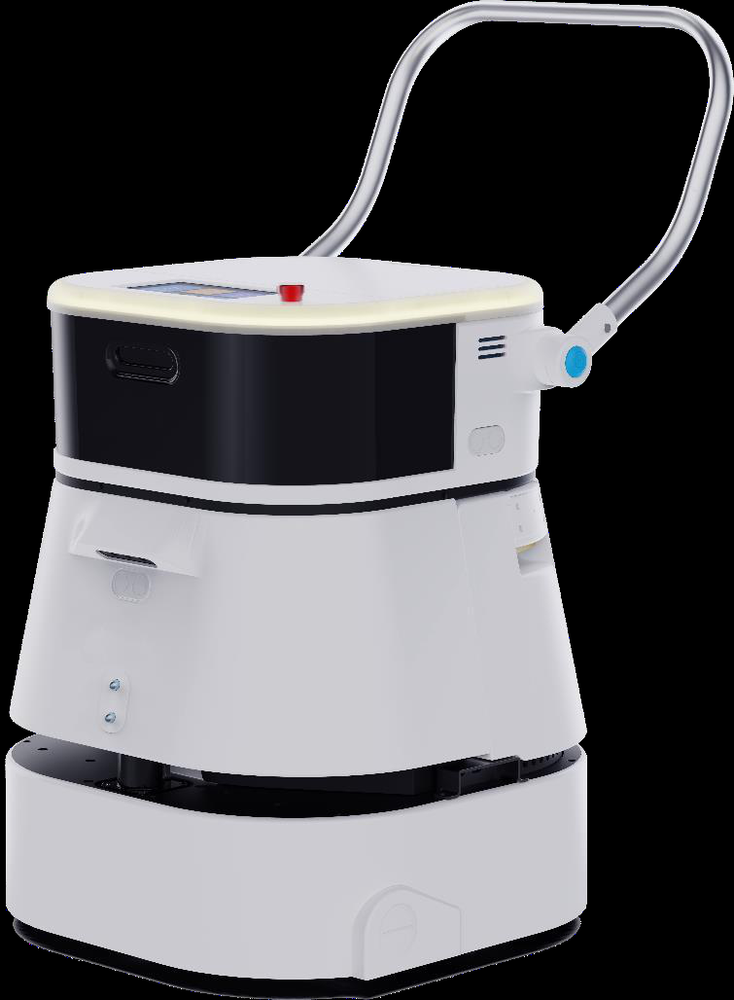

### Page 7

Upgrade：Fully Automated — C2 PRO
C2 Pro integrates scrubbing, mopping, vacuuming and 
sweeping with separated cleaning mechanisms. Equipped 
with automated docking station, C2 Pro features 
automatic recharging and water exchange, minimizing 
manual operation.
For 1000 2 0 0 0 ㎡ Cleaning
Automatic 
Cleaning
24/7 Autonomous Cleaning
Comprehensive 
Upgrade
Smart 
Docki ng

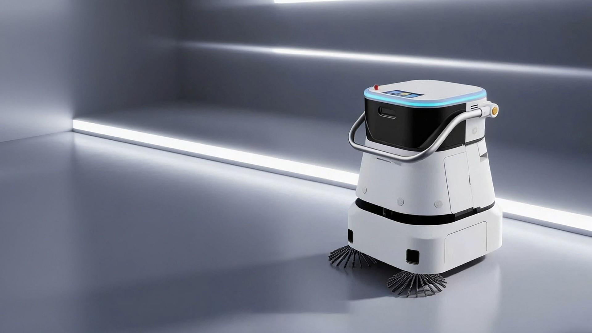

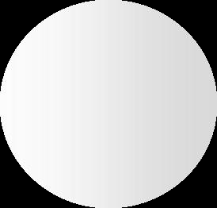

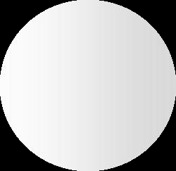

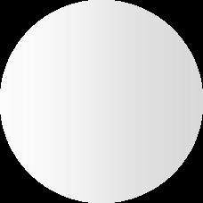

### Page 8

24/7 Automatic Cleaning with Maximum Coverage
• Quick-release key components enables immediate maintenance 
with ease even for non-specialists. Modules can be replaced.
• Quick replacement: Slide-out design for squeegees and cleaning
brushes + magnetic attachments for side brushes.
Better Cleaning Performance
• Zoned Task Scheduling: Cleaning machenism 
automatically switches according to cleaning modes
• Easily handles fine dust and stubborn stains, achieving 
spotless cleaning with floor drying in seconds
• Super Efficiency: Simultaneous dry and wet waste 
removal—one task, triple the efficiency
• 0-Edge Cleaning: Side brushes enable edge-to-edge
coverage with no gaps or missed spots
Modular Design, Easy to Maintain
Automatic Water 
Refill and Drainage
Automated docking station enables 
automatic recharging and water 
exchange, minimizing manual 
operation.
Optional External 
Water Tank
Difficult to modify plumbing? 
Choose the mobile water tank for 
flexible installation without 
complex plumbing modifications.
Upgraded Aotumation

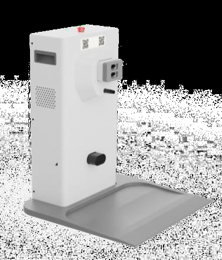

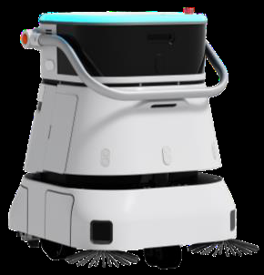

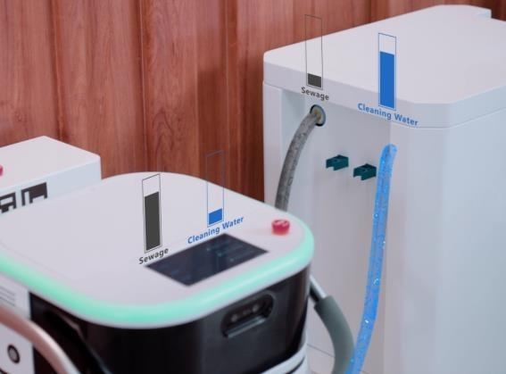

### Page 9

Product Feature
Fully Automated
Scrubbing, vacuuming, 
sweeping, mopping, suitable for 
all floor types. Auto-recharging, 
automatic water refill & 
drainage, minimizing manual 
operation.
Zoned Operation
The robot automatically 
adjusts cleaning modes and 
efficiently performs different 
tasks across areas.
0-Edge Cleaning
Side brushes enable edge-to- 
edge coverage with no gaps or 
missed spots.
High Efficiency
Efficient and seamless, with a cleaning 
capacity of 500-800㎡ per hour.
Modular Design
Easy to use and maintain
Tile floor – scrubbing 
Carpet – vacuuming 
Heavily stained tile floor 
– scrubbing & vacuuming

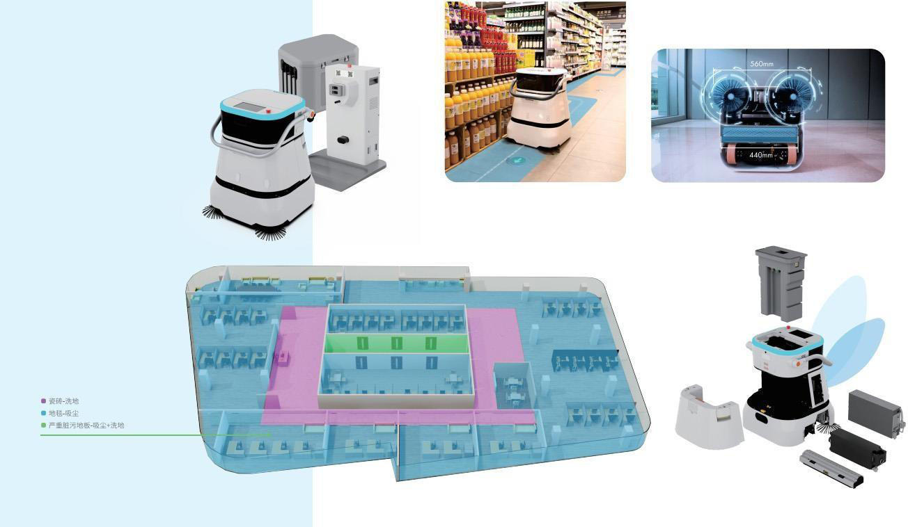

### Page 10

Smart Task Execution
Large-Scale Mapping: supports over 100,000㎡ mapping area
High Mapping Precision: up to ±1cm accuracy
Smart Route Planning: real-time updates for new routes within 1 second if changes in 
cleaning condition
Smart Obstacle Avoidance
UAV–level multi-sensor navigation, intelligent obstacle avoidance, anti-collision,
and anti-fall protection.
IOS
Multiple Interaction Platform
·App & web-end software & onboard screen for 
fast deployment
· App is compatible with both IOS and Android
systems
· Digital management; smart notifications via App

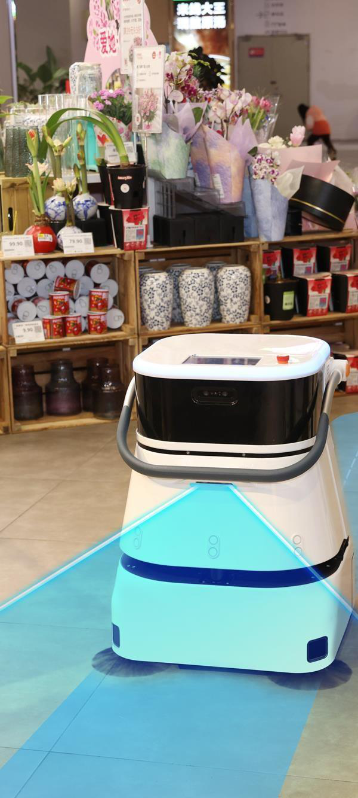

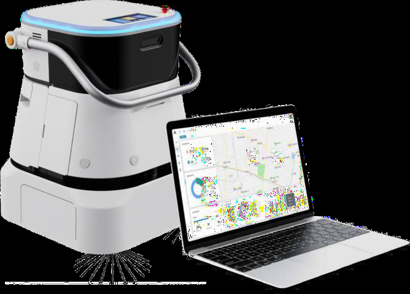

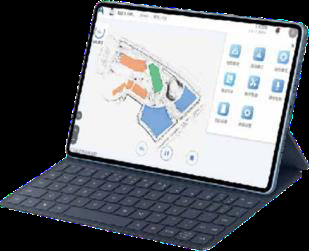

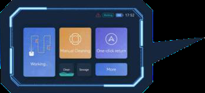

### Page 11

Specifications

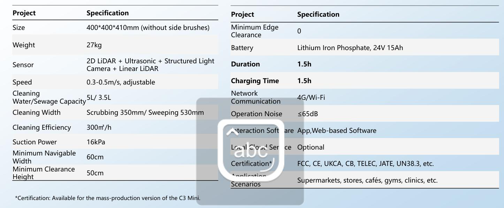

### Page 12

Redefining Smart Cleaning for Compact 
Commercial Spaces
Compact and Upgraded— C3 Mini
For 100 1000㎡ Cleaning
C3 Mini integrates sweeping, vacuuming and 
scrubbing  with  separated  cleaning  mechanisms.  Its 
compact body and precise navigating is perfect for 
small commercial spaces. C3 Mini is ideal for multiple 
floor types and minimizes working noise to achieve 
high-frequency and high-standard cleaning.
High
Efficiency
Healthy 
&
Quiet

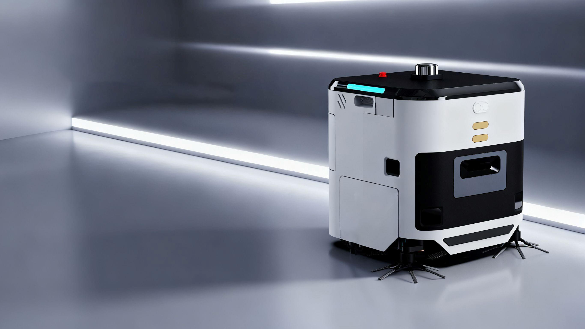

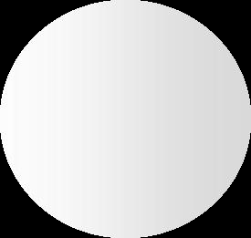

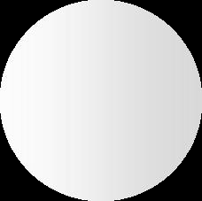

### Page 13

C3 Mini — Redefining Smart Commercial Cleaning
Functional, Healthy, Quiet
• Full coverage: sweeping, vacuuming, scrubbing, and 
mopping with side brushes, leaving no missed spot.
• Antibacterial Design: Antibacterial materials ensure
99.9% sterilization efficiency for a heathier clean.
• Low-noise: Optimized noise control; noise below 60 dB 
during cleaning.
Modular Design, Easy to Maintain
• Easy plug-and-pull water tanks and dust box
• Slide-out design for roller brushes
• Tool-free replacement of squeegee
• Straight Pipeline Structure enables easy dust removal
Millimeter-level positioning and
navigation, never get lost
50 cm body, 60 cm cleaning 
width — full coverage.
Homocentric square shaped 
cleaning route for open spaces and 
zigzag shaped for narrow spaces.

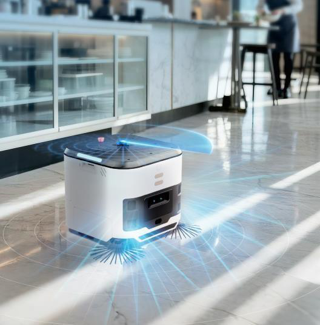

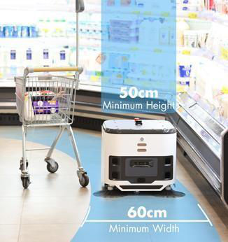

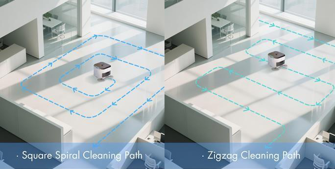

### Page 14

Product Feature
Sweeping
Vacuuming
 
Scrubbing
Modular Design
Easy to use and maintenance
3-in-1 Cleaning
Simultaneous dry and wet stain removal— 
one task, triple the efficiency
Deep & 0-Edge Cleaning
The right side brush extends outwards for additional reach, 
enabling true 0-edge cleaning with no missed spot
Auto-Adjusting 
Cleaning Mechanism
Dual-System Cleaning 
for Dry and Wet Wastes
Super Suction Power
Adaptive Navigation
Scrubbing
Vacuuming

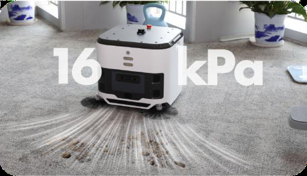

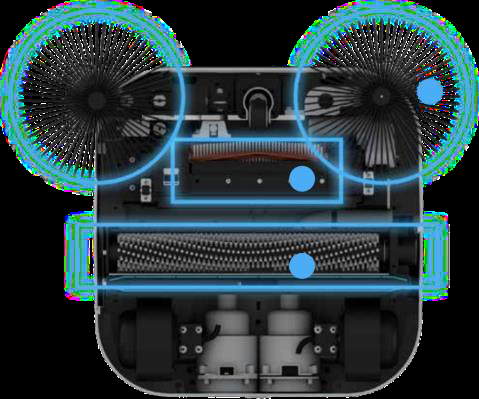

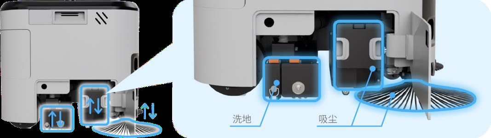

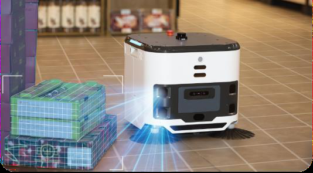

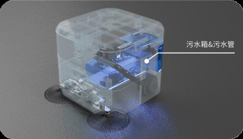

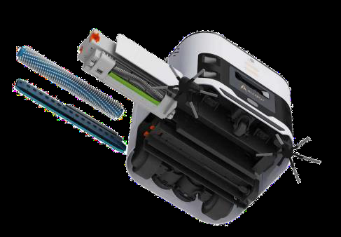

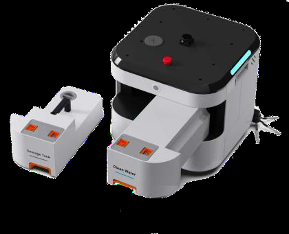

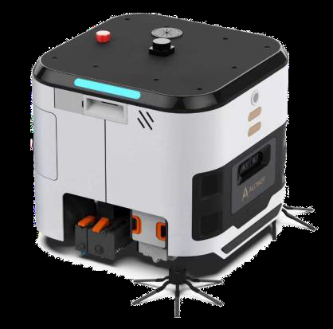

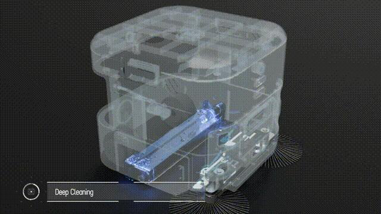

### Page 15

Specifications

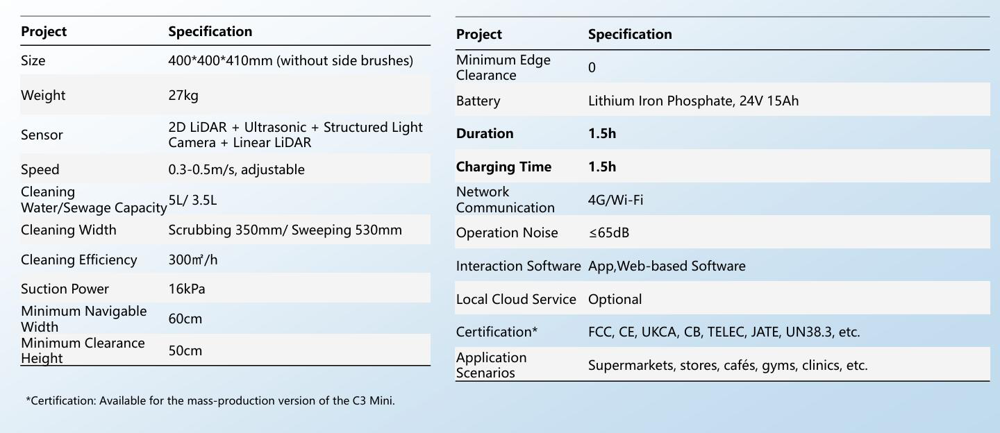

### Page 16

Advantage
IoT Integration; Safety & Protection;
Wide Application; Strong Production Capacity

### Page 17

Elevator-Calling 
Module
Auto Elevator Riding & Gate Passing
Commercial Cleaning Robot
Supports IoT integration with elevator and gate systems for automatic elevator riding and access gate passing.

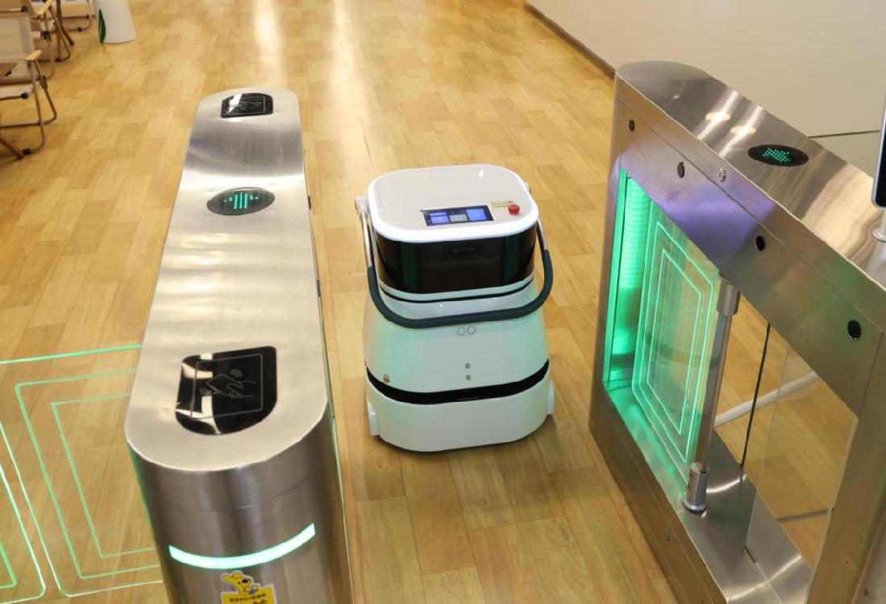

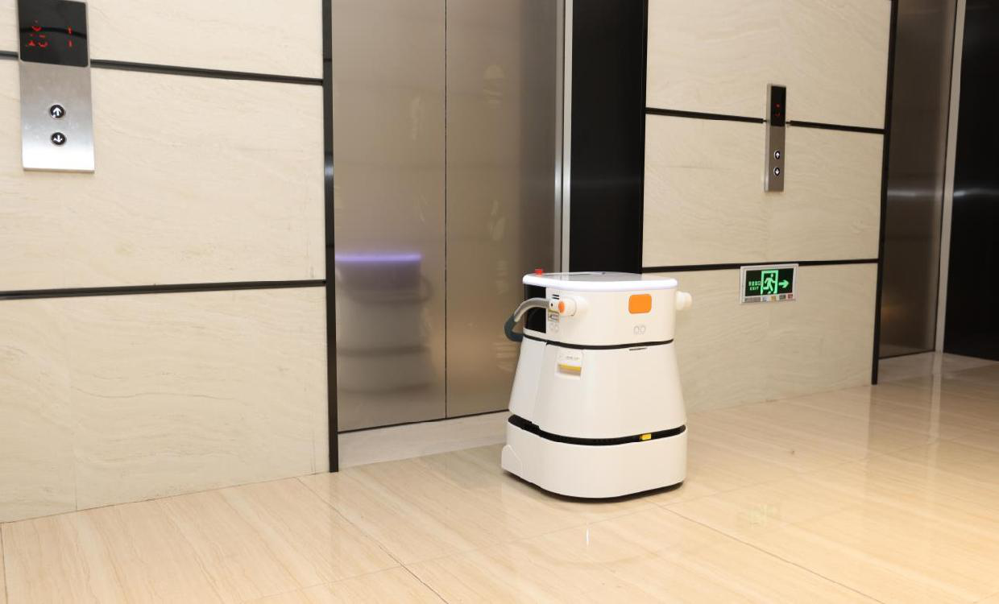

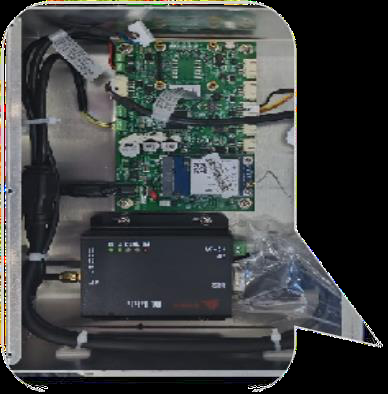

### Page 18

Comprehensive Safety Protection
Usage Safety 
0 Data Stored
Data Safety: No video records stored. Supports on- 
premise installation.
Warranty: 1-year warranty; extendable upon request
Multi-Sensor for navigation, 
0 Accident
Sensing Type
Reliabi 
lity
Nominal 
Detection 
Range
Detection Function
LiDAR
High
30m
Wide-area depth 
information & static / 
moving obstacles
Structured-light 
Camera
Very 
High
3m
Target distance and 
prevents falls
Ultrasonic Sensor
Very
High
3m
Surrounding obstacle
distance
Line Laser
Very 
High
0.3m
close-range low obstacles
Safe Battery Design,
0 Accident
For C 2 & C 2 Pro
LFP(Lithium Iron Phosphate)battery for enhanced safety, with 3000 
sets without any accidents.
Fire-Resistant Design: Rugged Enclosure made of high-grade 
metal (puncture-resistant), High-strength aviation-grade aluminum 
6061 sheet metal; plastic parts made of flame-retardant materials.
Charging & Discharging Protection: Equipped with voltage limit 
protection, leakage protection, overheat protection, current limit 
protection, short circuit protection, reverse connection protection, 
overcharge/discharge protection, etc.

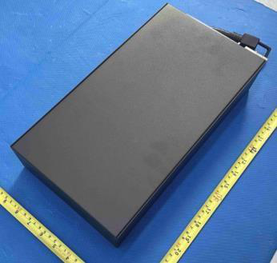

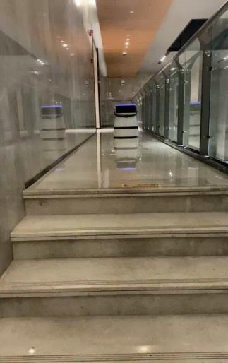

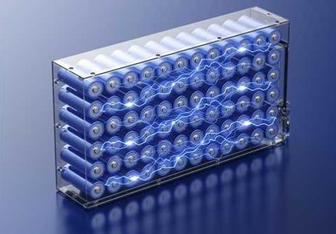

### Page 19

Certifications & Insurance
Global 
Insurance
Up to multi-million value
Domestic coverage: 
R M B  10 million
International coverage 
(including US & Canada): 
U S D  3 million
CB, TÜV (EU), FCC (US), PSE (Japan), UKCA (UK)
Full ISO certification
Battery certification 
ROHS+REACH+PAHS chemical 
safety certifications
Transportation 
Certification
Certification

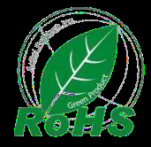

### Page 20

Applicable Scenarios
Office building
Apartment
Shopping Center
Restaurant
Theater
Hotel
Airport
Subway
Supermarket
Warehouse

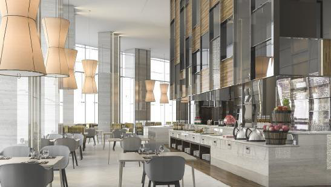

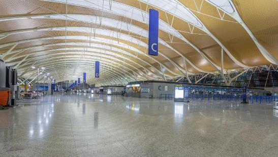

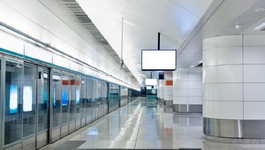

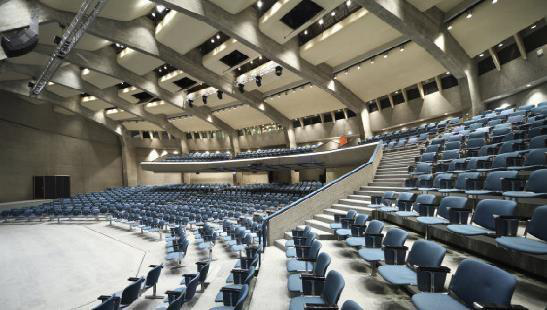

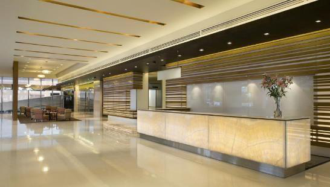

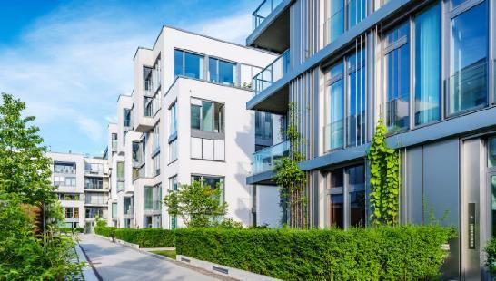


### Page 21

Applicable Floor Types
Marble
Ceramic Tile
Terrazzo
PVC
Epoxy Resin
Floor Paint
Wooden
Short-Pile Carpet


### Page 22

Production Capacity
· Maximum monthly capacity: 1,000 units/month
·Manufacturing capability: Fully self-developed products, 
exported to over 30 countries and regions worldwide.
Total Factory Area: 6,000 m²
Includes: integrated offices, meeting rooms, engineering 
offices, warehouse management, production workshops, 
material inspection zone, finished goods inspection zone, 
tool room, product showroom, material temporary storage, 
and finished product warehouse.
Production Overview


### Page 23

Airport · Europe
University · Japan
Shopping Mall · Singapore
Chain Supermarkets · Europe
Hotel · South Korea
Factory · Singapore
Factory · Europe
Chain Supermarkets · USA
Warehouse · Europe
Office · Germany
Chain Supermarkets · Germany
Chain Supermarkets · Europe
Cases


### Page 24

T H A N K S
https://www.aomanfuture.com/


## PDF: 已修改-C3 Mini Product Introduction 2026 

### Page 1

C3 Mini
Compact: Redefining Smart Cleaning  
for Small Commercial Spaces
Shenzhen aoman future robotics Co., Ltd.
www. aomanfuture.com
Product Introduction
Commercial Cleaning Robot  -C3 Mini
www.aomanfuture.com


### Page 2

M a k e  R o b o t s  s e r v e  t h e  w o r l d  B e t t e r    》》》》》》》》
•  Founded in 2015,   is a national high-tech enterprise in the field of commercial intelligent 
robotics and a certified “Specialized and Sophisticated Little Giant”.
•  With nearly two decades of expertise, our core team has extensive experience in multi-
sensor  fusion, artificial intelligence, and intelligent navigation technologies.
                                   :     :      :
2015.7        2017.1        2018       2019.1       2021.7        2022         2023        2024           2025          2026
Company 
Milestone
Secured the
largest single  
commercial
cleaning robot 
order for 1,000 
units
Developing local 
service networks 
to provide
customers with  
superior support
Completed orders
for over 200 units of 
commercial
cleaning robots
Released the 
world’s first
modular
commercial
cleaning robot
Developed the 1 st 
generation of
commercial
cleaning robot
C2 Pro released, 
enabling full
automation for   
cleaning robots
C3 Mini released. 
Global business  
keeps growing
Delivered the 1st 
unmanned
vehicle
The 1st  generation of 
navigation controller
Established


### Page 3

-C2
Smart
Management
Safety &  
Protection
All-in-One 
Cleaning
Shenzhen aoman future robotics Co., Ltd.
Modular
Design
03.
04.
01.
02.
www.aomanfuture.com


### Page 4

PART ONE
 -C2
                                                                                                                                                     
Shenzhen aoman future robotics Co., Ltd.
www.aomanfuture.com


### Page 5

Sweeping
Vacuuming
Scrubbing
Antibacterial Design
Antibacterial materials used in key components 
ensure up to 99.9% sterilization efficiency
All-in-One 
Cleaning
All-in-One Cleaning
Integrates sweeping, vacuuming, and washing, 
with a retractable brush for 0-edge cleaning.
3-in-1 Cleaning
Simultaneous dry and wet stain
removal—one task, triple the efficiency
Dual-System Cleaning 
for Dry and Wet 
Wastes
Auto-Adjusting
Cleaning 
Mechanism
Super Suction 
Power


### Page 6

Smart Task Execution
Large-Scale Mapping: supports over 100,000㎡ mapping area
High Mapping Precision: up to ±1cm accuracy
Smart Route Planning: real-time updates for new routes within 1 
second if changes in cleaning condition
Homocentric Square  
Shaped Cleaning Route
· Higher efficiency in 
square and open spaces
Zigzag Shaped
Cleaning Route
· Higher efficiency in 
long, narrow spaces
· Robot automatically recleans
missed areas caused by charging or 
avoiding obstacles.
Missed Zone Reclean


### Page 7

Intelligent Obstacle Avoidance
Autonomous navigation with multi-sensor fusion for obstacle, collision, and fall prevention — safety at driverless level.
Anti-Drop Protection
Avoid Temporary
Obstacles
Avoid Low Obstacles
Advanced
Climbing Ability


### Page 8

Supports IoT integration with elevator and gate systems for automatic elevator riding and  access gate passing.
Auto Elevator Riding & Gate Passing
 - C 3  Mini


### Page 9

PART TWO
 -C2
                                                                                                                                                     
Shenzhen aoman future robotics Co., Ltd.
www.aomanfuture.com


### Page 10

Quick Replacement
· Magnetic attachments for quick replacement 
of    squeegees and brushes.
· Minimizes manual effort and maximizes 
efficiency.
Quick-Released
· Components can be quickly taken out 
for maintenance and cleaning.
· Enables deep cleaning, prevents 
secondary contamination, and extends 
lifespan.
Modular Design9 Easy Maintenance
Releas  
able
Mag
netic


### Page 11

PART THREE                                      
 -C2
                                                                                                                                                     
Shenzhen aoman future robotics Co., Ltd.
www.aomanfuture.com

### Page 12

IOS
Digital Monitoring
· Mobile App + remote
deployment platform,
supporting device data analysis     
and decision-making，
· APIs for  private secondary          
development.
Multi-Platform
operation
Onboard screen, mobile App,
browser on laptop；
App supports iOS and Android
systems.
powered by 
Advanced AI
Technology
on APP
smart Not i i  cations
Automatically notifications for 
maintenance,
 faults, and consumable 
replacement.


### Page 13

PART FOUR                                         
 -C2
                                                                                                                                                     
Shenzhen aoman future robotics Co., Ltd.
www.aomanfuture.com

### Page 14

Sensing Type
Reliability
Nominal
Detectio
n Range
Detection Function
LiDAR
High
30m
Wide-area depth information &
static / moving obstacles
Structured-light
Camera
Very High
3m
Target distance and prevents
falls
Ultrasonic Sensor
Very High
3m
Surrounding obstacle distance
Line Laser
Very High
0.3m
close-range low obstacles
Data Safety: No video
records stored. Supports on- 
premise installation.
Warranty:  1-year warranty;
extendable upon request.
Comprehensive Safety Protection
Usage Safety
0 Data Stored
Multi-Sensor for navigation,
0 Accident


### Page 15

Applicable Scenarios
Educational 
Facility
Office Building
Convenience 
Store
Supermarket
VIP 
Lounge
Retail Store
Catering
Library
Hotel
Cafe


### Page 16

Applicable Floor Types
Marble
PVC
Short-Pile Carpet
Epoxy Resin
Ceramic Tile
Floor Paint
Wooden
Terrazzo


### Page 17

Project
Specification
Minimum 
Navigable Width
50cm
Cliff Detection
Height
9cm
Minimum Edge
Clearance
0
Battery
Lithium Iron Phosphate 25.6V 15Ah
Duration
Scrubbing 2.5h  Vacuuming 2h
Scrubbing + Vacuuming 1h
Charging Time
2h
Network
Communication
4G/Wi-Fi
Noise
≤65dB
Interaction Platform App, Web-based Software, Onboard Screen
On-premise Cloud   
Service
Optional
Certification
CB, PSE, etc
Scenario
Supermarkets, stores, cafés, gyms, clinics, etc.
Project
Specification
Dimension
400*400*410mm (without side brushes)
Weight
30kg (empty) 35kg (with water)
Sensor
2D LiDAR + Ultrasonic + IMU +
Structured Light Camera + Linear LiDAR
Speed
0-0.5m/s
Tank Capacity
4.5L/ 2.8L
Dust Bag Capacity
0.7L
Cleaning Mode
Scrubbing/ Vacuuming/
Scrubbing + Vacuuming
Cleaning Width
Scrubbing 310mm；Vacuuming 
530mm
Cleaning Efficiency
Scrubbing 200 ㎡/h；Vacuuming 300 ㎡
/h
Suction Power
15kPa Maximum
Single Cleaning Area
Specifications
Scrubbing 500 ㎡
Vacuuming 600 ㎡

### Page 18

THANKS
S h e n z h e n  aoman future robotics Co., Ltd.
www.aomafuture.com        86-189 2886 4959           larina@aomanfuture.com

## 目录内独立图片


## 视频（未纳入仓库）

<!-- 视频文件（未复制）: `aoman future cleaning c2 pro.mp4` -->

<!-- 视频文件（未复制）: `aoman future cleaning robot c2.mp4` -->

