# 酒店配送机器人（新产品资料导入）

_来源目录：`酒店配送机器人`_

---

## PPTX: EN-格格产品介绍英文版 logo已调整3.13

### Slide 1

Aoman Transport Robot

-DOUBLE

### Slide 2

Super-large Capacity: accommodate items of more specifications

Fingerprint Identification:  Convenient operation and traceable workflow

Voice Interaction: a small social talent in hotels to enhance guest experience

Upgrade of Whole Machine: enhanced competence to pass/avoid obstacles and adapt to all sorts of hotel environments

Flexible Customization: two customized models of disinfection/security to meet multiple demands

### Slide 3

Smaller Body, Larger Capacity

70L+super-large capacity, easy to accommodate large-capacity items.
   (2-inch pizza/67 bottles of 550ml mineral water/double-layer cake)

The upper and lower embedded design for opening and closing doors does not occupy the surrounding space.

It can accommodate all the takeaways you can imagine in the hotel,

40L

30L

320 X 315 X 409mm

320 X 235 X 409mm

### Slide 4

"Narrow" is "wide"

"Slim" figure, making it possible to pass the length of 60cm at least.
Stronger passability in dense spaces such as elevators and linen trucks.

No need to turn around in a narrow elevator, go straight in and out.
 Running more efficiently and saving transportation time.

### Slide 5

25mm

13°

40mm

It can pass through thick carpets, wooden floors, marble joints, up and down slopes, etc.
It is more friendly to the environment and tremendously avoids the secondary transformation.
Vision sensors and algorithms have been upgraded to make avoidance of obstacles more sensitive and path more accurate.

Maximum hurdle: 25mm
Maximum crossing ditch: 40mm
Maximum slope passed: 13°

Comprehensive Passability, Adapt to a Variety of Space Environment

### Slide 6

Unlock by fingerprint
Digital management of authorization/operation
Safer to use

Unlocking by fingerprint, exclusive power for special person, traceable operation and safer management
Used merely with a single click, flexible and in enhanced service efficiency.
Digital/quantitative management of operation records
Automatically counting the utilization rate of employees and assisting in performance appraisal

### Slide 7

Multi-piles for one robot/multi-pile for multiple robots
Multi-location services in different time periods

One robot can correspond to multiple charging piles, and it can stand by at different times and places without remote call.

Example：the robot takes delivery/guides customers frequently during the day, and is arranged to stand by in the lobby on the first floor.
   The robot has frequent tasks of delivering necessities to guests at night, and is arranged to stand by in the housekeeping department upstairs.

### Slide 8

Intelligent Voice Interaction:
Offer Better Interactive Experience to Residents

Natural semantic comprehension, personified and efficient communication for services
Six microphones are used for sound reception to accurately identify the position
The hotel's exclusive voice library can be imported to furnished personalized voice interaction.
A small social talent in the hotel, in order to enhance the user experience and contribute to the new marketing of the hotel

### Slide 9

Connectable Intelligent Container
Seamlessly Connected with Mall /HDOS

It is matched with the scheme of the original intelligent container /HDOS, and no additional container is needed.
One machine can be used for multiple purposes and connected instantly, which is the first choice for new robots in the hotel.

Note: Yunku models of containers are supported

### Slide 10

In-cabin ultraviolet lamp
Independent disinfection of articles to guarantee safety

(disinfection-style)

Ultraviolet disinfection can be done in all directions without dead ends, so as to ensure the hygiene of articles and lower the risk of cross-contamination.
After storing articles and closing the door, the disinfection function will automatically turn on; When the cabin door is opened and things are taken out, the disinfection function will automatically turn off, which is convenient and safe.

Note: It needs to be customized.

### Slide 11

The robot can visually identify dangerous behaviors and help upgrade the hotel's security.

Intelligent patrol of robot service+analysis of high-performance AI video

Quickly locate dangerous behaviors and abnormal people.
Give early warning in real time and make closed-loop response and processing
Raise the security level of the hotel and put an end to potential safety hazards

Please don't gather in the corridor, thank you!

Note: customized

(Security-style)

### Slide 12

What is a user-friendly robot?

Other robots

Aoman robots

VS

### Slide 13

Overall dimensions:  490mm long× 420mm wide ×975mm high
Body weight: 63kg
In-cabin load: 15kg
Cabin volume: upper cabin 40L, lower cabin 30L
Minimum passing width: 55cm
Moving speed: 0.9m/s — 1.5m/s

Product Parameters

### Slide 14

Dynamic stickers, novel and eye-catching.
Cartoons/emoticons, multiple choices for you

### Slide 15

Robots make human beings happier.

@aomanfuture.com

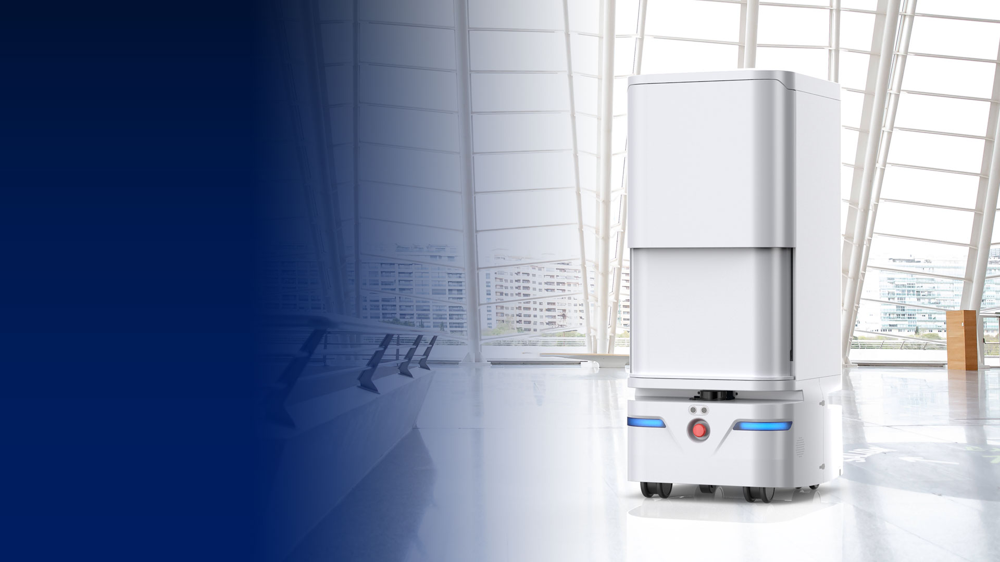

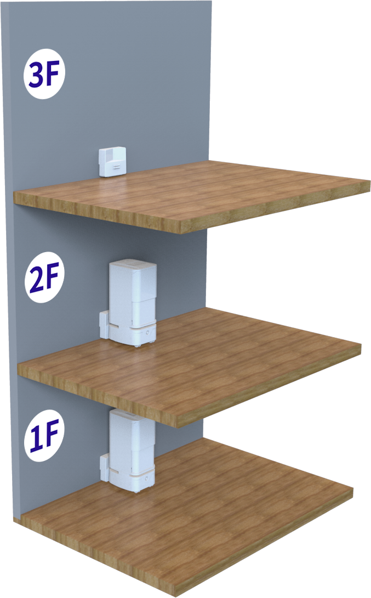

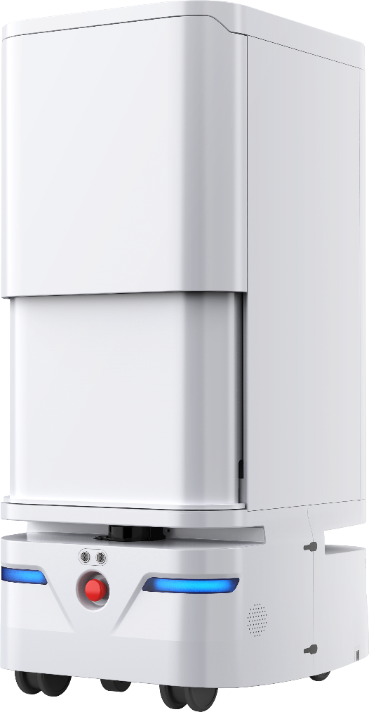

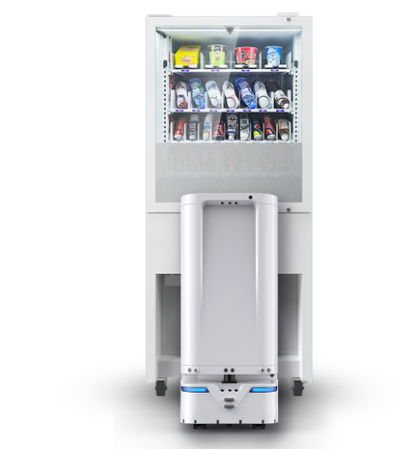

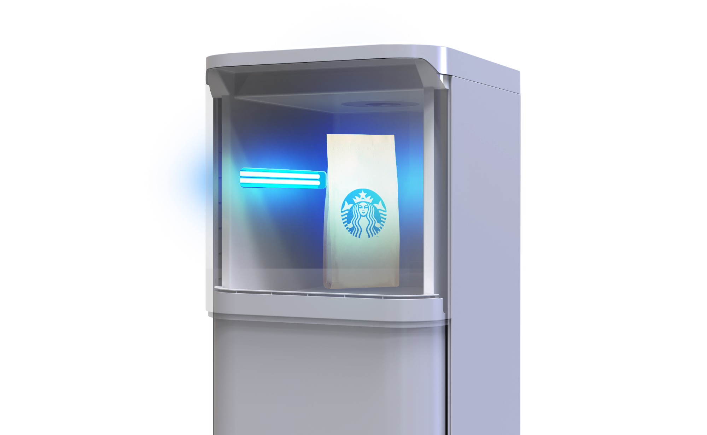

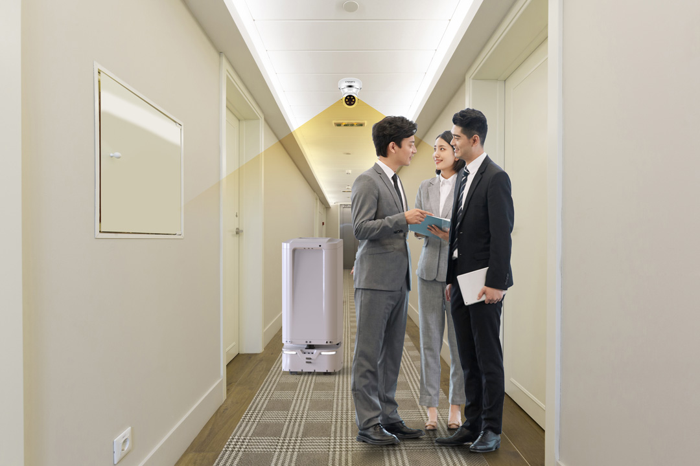

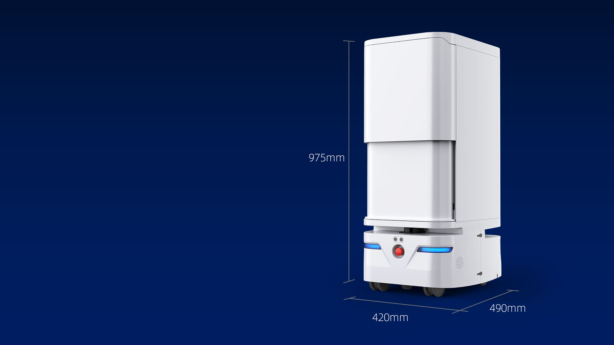

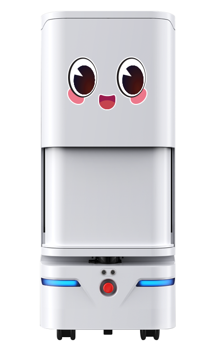

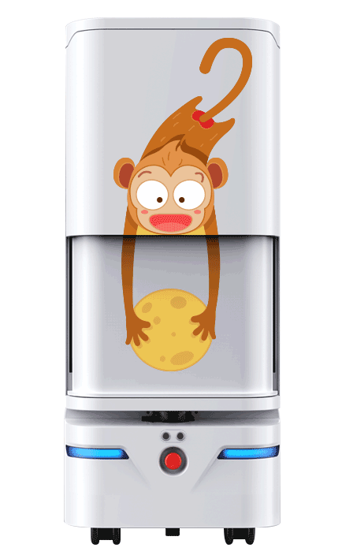

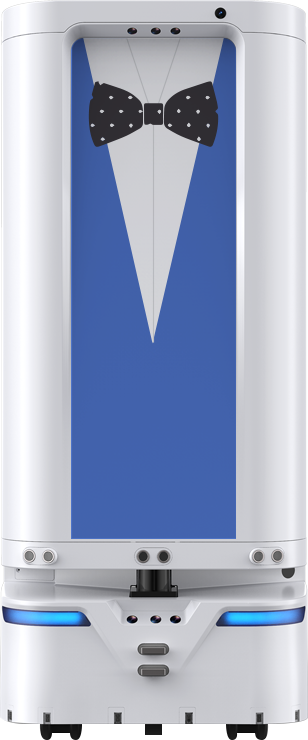

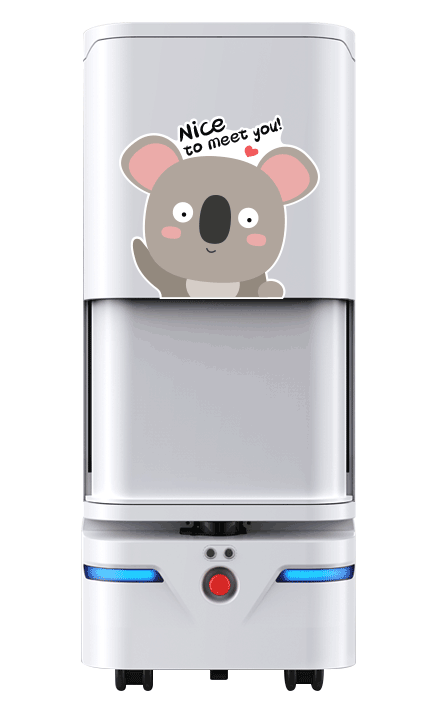

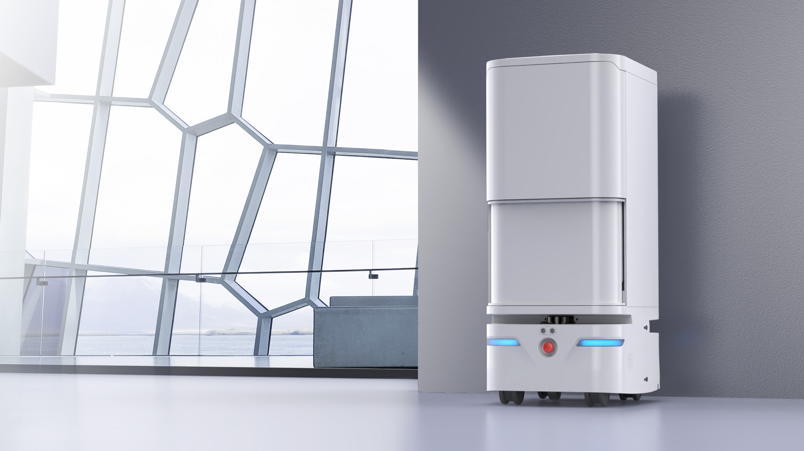

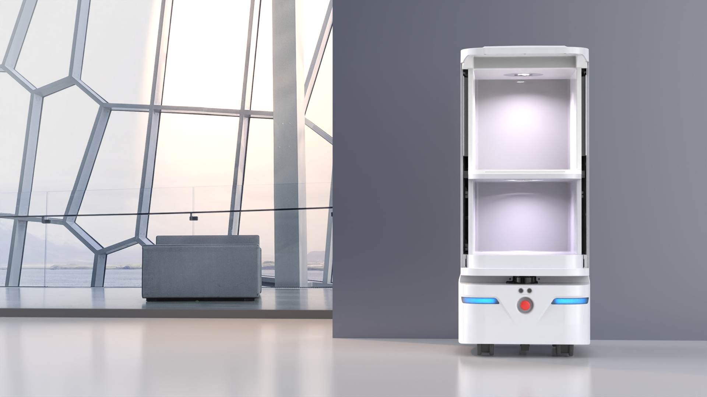

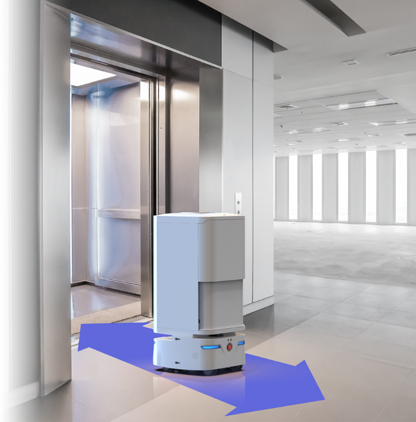

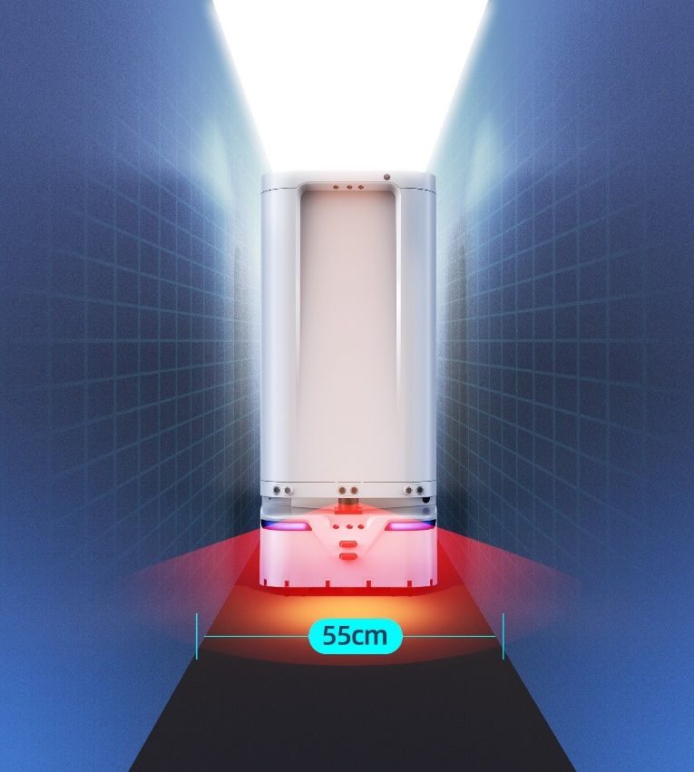

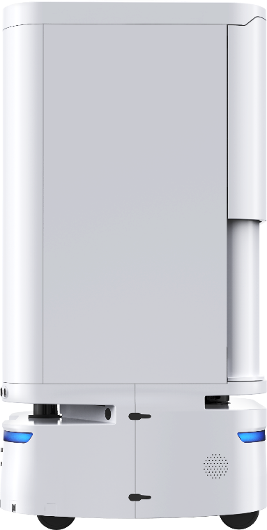

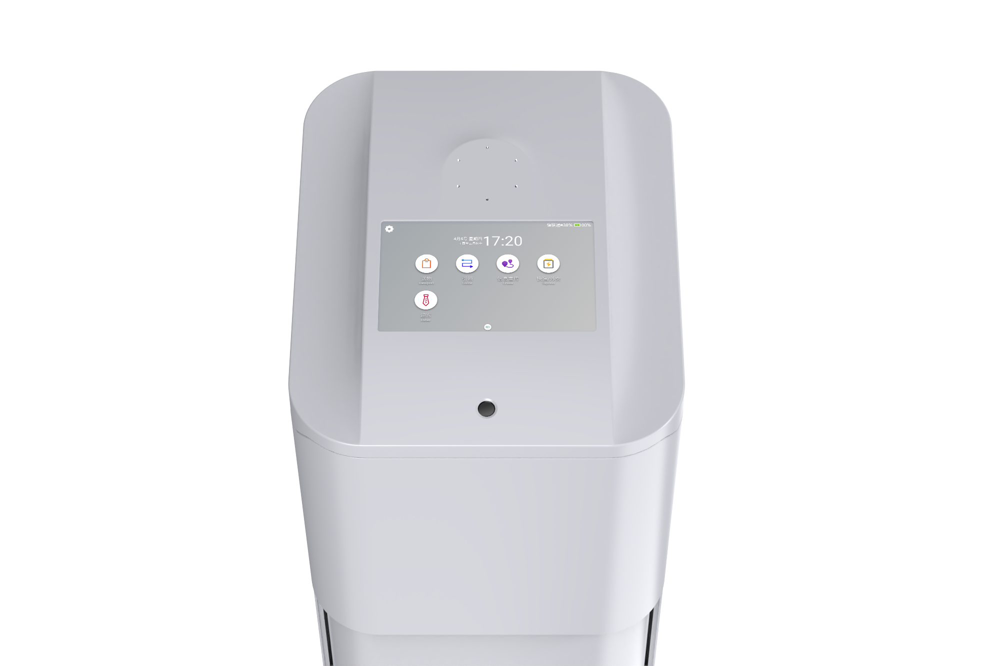

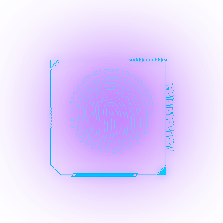

## PPTX: EN-酒店数字化2.0-HDOS-s logo已调整3.13

### Slide 1

HDOS 2.0A New Smart Choice for Hotels in the Digital Era

HOTEL DIGITAL OPERATION SYSTEM

### Slide 2

Aoman Technology A choice for more than 20,000 hotels

More than 1 billion elevators 
More than 41 million kilometers 
Serving more than 500 million people 
More than 5.9 million good reviews

7*24-hour services 
Deployment by county-level cities across the country 
Professional operation guidance team

System interconnection with TOP 10 groups 
Ecological interconnection with more than 100 hotels 
Opening of 78 API interfaces in 19 categories

Establish long-term partnership relations with quality products and services

### Slide 3

Reconstruction of time enables the robot to be engaged in more tasks

Task distribution diagram within 24 hours  A hotel in Beijing·in a single month

Delivery robot for single purpose

New generation service robot UP
 (delivery + cleaning)

Average daily working hours

Average daily working hours

7.5h

10.8h

Task distribution diagram within 24 hours A hotel in Beijing named Wei X·in a single month

The service duration

### Slide 4

The service duration is improved by 44% Complicated and messy things of a hotel 
Liberate manpower to be engaged in work with more warmth

More than 15 departments

More than positions

More than 1000 different items

### Slide 5

What can be done with HDOS to reduce operational and management costs

Guest demands 
Delivery

Takeout 
Delivery

Cleaning of public areas

Security patrol

Quality control

Answer calls from guests

Record of facility repair

Hotel security patrol and early warning

Training

Drafting operation manuscript

Deliver 
luggage

### Slide 6

Which services are prone to complaints?

Check-in 
Check-out 
Invoicing 
Takeout

Car hailing 
Travel recommendation 
Shopping 
Body building

Guest demanded goods 
Guest demands 
Internet access 
Take a shower

Wash clothes 
Watch TV 
Luggage storage 
Luggage pick up

Sleep 
Meeting 
Reception 
SPA

Massage 
Hotel activities 
Search surrounding information 
Seeking help and information

Takeout 
Guest demanded goods

Take a shower 
Wash clothes

Guest demands 
Internet access

Watch TV 
Sleep

### Slide 7

What services can HDOS be used in to create a better experience for guests?

Accurate information provision 
Clean and comfortable environment 
Efficient delivery service without omission 
Sound facility and equipment 
Clear and eye-catching reminder 
Safe stay environment

Warm 
Personalized 
Exactly right

### Slide 8

Digitization of task allocation

Demand digitization

Operational employee digitization

Self-service check-in machine 

Elevator 

Door lock 

PMS

Guestroom phone 
Guestroom television 
Loudspeaker 
Mini program 
Intelligent guestroom control

Gym 
Laundry machine 
Restaurant 
Access control 
…

Light 
Water/electricity 
Air conditioner 
Air purification 
…

AI brain 

Order conversion 

Task assignment 

Task feedback/evaluation

Cellphone/telephone notification 

Receipt printer 

Walkie talkie 

Computer 

PMS

Middle platform

Background

Guest

Demands from check-in guests

Demands from staying guests

Task    
offloading

HDOS- with scheduling system as the core

Attendant

Robot

Front warehouse

Pursue the best overall efficiency and the optimal accommodation experience

Man- 
Robot 
coordination

### Slide 9

Grid/UP

Intelligent front warehouse

Mini program for staying service

AI voice customer service

Auxiliary notification hardware

HDOS 2.0

Upgrade from operation by a single robot to multi-robot collaboration/man-robot collaboration 
Integrate from services provided by a single robot to the hotel digital solutions during stay of guests

Hotel digital operation system

### Slide 10

HDOS-AI intelligent voice housekeeper

Demands in 3 major categories and over 1,000 purposes

### Slide 11

Consultation/complaint  Timely response from AI intelligent voice housekeeper

Guestroom phone 
Smart speaker 
Smart TV 
.....

AI autonomous response 
Liberate manpower for the reception desk

AI autonomous recognition 
Timely switch to the human customer service to reduce complaints from customers

Consultation

Complaint

Guest demands

### Slide 12

Semantic understanding beyond guest expectations

A good helper for intelligent responses to identify guests’ intentions

Clear and accurate identification of multiple intents/repeated requirements

Answer one question comprehensively

Click the icon to listen to the voice

### Slide 13

Pre-complaint management

Click to listen to audio recordings

Prompt and proper handling of complaints. 
Problems are recorded to help the hotel in management quality judgment.

Complaints and warning

Guest complaint report

### Slide 14

HDOS- Delivery/Shopping/Repair report/Room service

Mall QR code 
Guestroom phone 
Smart speaker 
Smart TV 
.....

Guest demands

The robot automatically takes orders and connects to the container to pick up and deliver goods

After the guest pays, the robot connects to the container to pick up and deliver goods

The robot automatically generates work order to notify the relevant service personnel

Free guest demanded goods

Purchasing of priced goods

Room service/repair report

Multi-robot cooperation/man-robot coordination

### Slide 15

Delivery/shopping/room service - Full-process service closed-loop

### Slide 16

Is it overwhelmed to deliver guest demanded goods in rush hours?

The front warehouse can store toothbrushes, combs, shower caps, bottled water and other common customer demanded goods 
The attendant does not perceive the delivery by the robot in the whole process, and the manpower is liberated

Automatic closed-loop service  
Save hotel manpower costs

Upgrading in service quality  
Improve good reviews and repeated stay rate

The automatic warehouse automatically take orders, and makes fast delivery without missing orders 
Robot intelligent delivery/shopping experience, hotel technology-based services 
The robot is available to sell family planning supplies, and guests can follow the online mall to  get private shopping experience, which is intimate and thoughtful

Try to place the guest demanded goods into the front warehouse for the robot to deliver

### Slide 17

Front warehouse++ robot delivery: drinks/snacks/daily necessities/family planning supplies/small hotel peripheral products 
Manual/robot delivery: Hotel food and beverages/holiday gifts/hotel sleep supplies/scenic spot tickets

Hotel's robot mall increases both the hotel private traffic and revenue

Complete promotion functions attract fans and increase revenue

Support full reduction/voucher/flash sale and other forms of e-commerce promotion modes

Various and abundant goods available in the mall

### Slide 18

* With open data interface, guests can access the hotel's own online APP/ mini program

……

Each room corresponds to a QR code for accurate service

Cleaning and repair report

Guest supplies/lendings

Scan the QR code to search the frequently asked questions

### Slide 19

The process is traceable to ensure services without omission

### Slide 20

Dig out the hidden needs of guests

Among the wish list, the number one gift item in demand is mineral water, accounting for 7.5%, and toothpaste and toothbrushes rank second. 
Followed closely by the demand for razors, and men's shaving during business travel  still remains a rigid demand 
Staying guests also have demands for white sugar, especially those who love coffee; 
Multiple guests checking in at the same time have a demand for disposable paper cups in most cases; 
Individual guests have certain requirements on the quality of bath towels and pillows when checking in, and hope to use disposable bath towels and stress relief pillows;

Ranking of items that are demanded by guests but not supplied by hotels 
       Help hotels better fulfill customer demands

### Slide 21

Create better stay and work experience for your guests and employees

Traditional service process

After using AI+ robot

Hotel employees

Hotel guests

### Slide 22

HDOS-new generation multi-functional service robot UP

Split design | Modular upper warehouse | Automatic warehouse replacement | Multi-functions in one machine | Saturation operation by shift in different time periods

Smart robot service corps

### Slide 23

UP in hotels

### Slide 24

UP - delivery

Improved delivery efficiency brings an upgraded experience

Upper and lower dual warehouse design

Variable warehouse body

The large-volume double warehouses can accommodate a 10-inch cake

Camera inside the warehouse

The robot is able to switch model between 1 grid, 2 grids, 3 grids and 4 grids for delivery of goods according to the requirements under different scenarios

Check whether there are high-risk items in the warehouse 
and assist hotels to record robot delivery records

Split mobile robot platform

Body shell made of ABS material

Young and interactive robot interface

More suitable for the usage habit of young people, creating a more interesting and clear interface

Anti-fouling and anti-collision, simple and elegant

With an independent power source, 
Able to pass slopes with a gradient of 13° 
Support up to 11 hours of continuous operation

### Slide 25

The hotel can customize exclusive blessings, so that the robot will send blessings to the guests when they pick up the goods. With built-in music, the robot is able to send unexpected surprises to guests during important festivals.

Create warm check-in experience for guests and fulfill their emotional needs

An intelligent robot that can sing and send blessings

In-depth customer insights to realize their "wish list"

Please say something for me: Everything will be fine! 
 Thank you

Please play: For Jiuyue

No need manual delivery, 
ask the robot to deliver and say: Love you for ten thousand years

### Slide 26

UP - Cleaning

A cleaning robot specially designed 
for the hotel environment

With dust absorption/wet pushing/cleaning function in one machine

Automatic switching of cleaning modes 
for different floor materials

Maneuverable and flexible 
and works smoothly in small spaces

Professional 
carpet cleaning design

Automatically generate the cleaning work order 
after identifying the dirt

Automatically inform the attendants 
once identifying bulky wastes

Identification of valuables 
to prevent accidental inhalation

The mini program simplifies operation and 
automatically generates cleaning reports

### Slide 27

Major stains on carpets include 
debris, hair, and dust accumulated in fluff

Difficulties for hotel environment cleaning

The space is narrow and closed 
Heavy workload for cleaning against the wall

The carpet covers about 80% of the total area 
Carpets have high resistance and are prone to hair loss

Difficulty in recruiting housekeeping staff 
Serious employee turnover

Labor cost increases year by year 
High training cost

Difficult to monitor work effectiveness and duration 
Difficulty to guarantee the cleaning effect

Pain spots for hotel cleaning management

### Slide 28

Disc-type sparse edge brush 
Fit the edge to the maximum to clean the corners

Carpet slapping by high-speed nylon rolling brush  
Deep cleaning of sediments

H12 HEPA air filtration 
Avoid secondary air pollution

Aoman's patented anti-winding roller brush shaft design 
Effectively avoids hair entanglement

50000rpm high-speed brushless motor 
Greater air pressure and stronger suction

Work at low noise of less than 65 dB 
Silent operation in public areas at night

Specially designed for hotel carpet cleaning

### Slide 29

Automatically inform an attendant to clean up the bulky items 
The robot can actively identify bulky garbage/items (with a size of more than 2.5CM) along the way, and take photos to notify the administrator (Housekeeping Department/housekeeping staff) to clean up/dispose of them in time.

Smarter and know hotels better

Automatically generate cleaning task for small wastes  
The robot is able to discover fine debris on the way to deliver goods, create its own cleaning task and perform cleaning independently.

Send a report of missing valuables  
The robot can generate a missing report in case of identifying valuables, so that the mini program will pop up and give a reminder for item pick up and storage.

### Slide 30

The mini program makes shift arrangements on tasks and automatically generates cleaning reports

Robot cleaning trajectory map

Clearly mark the uncleaned area to guide manual replacement

### Slide 31

Feedback from hotel staff and guests

Mr. Jia, Director of Hotel Rooms: 
“It does look very clean, and the guests feel comfortable looking at it.”

Housekeeping staff: 
"The robot is really helpful, and we don't have to clean the hallways anymore

### Slide 32

UP- open delivery

Bottled water, whole box of drinks, printing paper, multiple parcels, printing materials and other large supplies

20-inch boarding box

96L large capacity | open design | flexible delivery | economical and practical

Delivery of large items

Luggage delivery + guidance

### Slide 33

HDOS AI scheduling 
Function expansion is implemented on time

The hotel's 24-hour 
self-customized service hours

### Slide 34

Convenient management ob the palm  Automatic task assignment Automatic generation of data reports and analysis reports

Management platform upgrade

AI voice report 
Real-time monitoring of robot status 
Cleaning task creation 
Inquiry of mall orders 
Container replenishment 
Report on data analysis of staying service 
Online repair feedback 
... ...

### Slide 35

Retain complete data of guest demands during their stays, assist managers to conduct fine and multi-dimensional analysis, and provide decision support for service quality management and business operation process optimization

Adjust operational decisions based on data analysis

### Slide 36

Delivery by intelligent automatic warehouse

Mini program for staying service

AI customer service specialist

3608 total calls

100 times

Delivery data

1,869 times

UP cleaning

25071m2

Scanning QR code for 571 times

Cleaning

Daily cleaning  
Cleaning passageways only

3,550 AI calls

Delivery by the robot

Delivery of takeaways/customer demanded goods for 1,869 times

113

work orders on maintenance and complaint

1,211

work orders of manual delivery

186

work orders of guestroom cleaning

Immediately save 
94h

Immediately save 
13h

Immediately save 
249h

Immediately save 
80h

Save 436h in total in August 
436h

Create GMV of 
RMB 2,432.3

1510 work transfer orders

The Call Center and the Housekeeping Department are merged to optimize the manpower structure

The housekeeping staff arrangement at each floor during the cleaning period is adjusted

The dust pushing task at night is assigned to the robot to perform

### Slide 37

Establish multi-ecological link to create hotel digital and intelligent service space

### Slide 38

Product iteration

Service response

Guarantee long-term value of products with continuous service capability

National operation and maintenance network

The software is updated and iterated on a weekly basis 
The continuous advancement of product performance can be guaranteed

After-sales mini program gives real-time feedback online and tracks the progress 
7*24 hours of response within 15 seconds

National professional engineers/deployment/operation and maintenance network 
The installation timeliness in county-level cities can be guaranteed

### Slide 39

A little assistant for package calculation

Customize your personalized digital solutions in a flexible manner

### Slide 40

Robots make human beings happier.

@aomanfuture.com

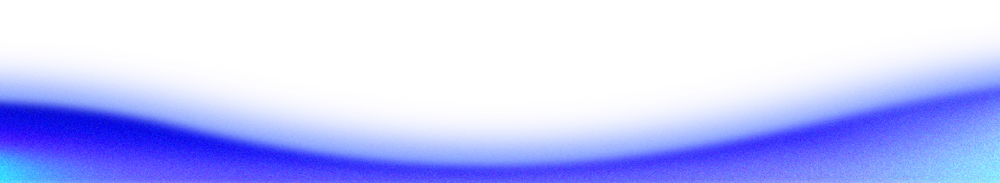

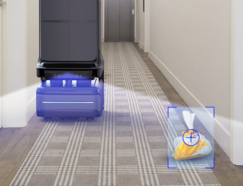

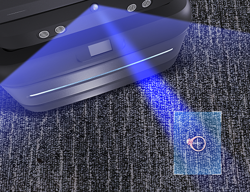

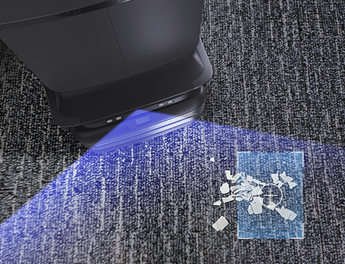

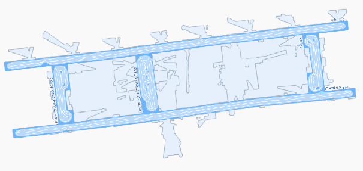

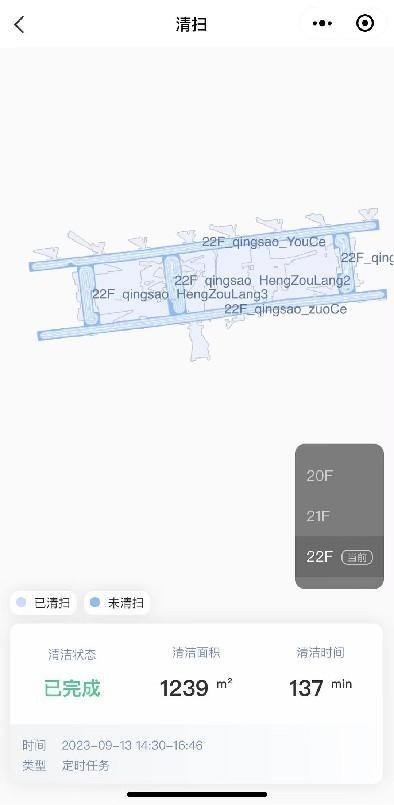

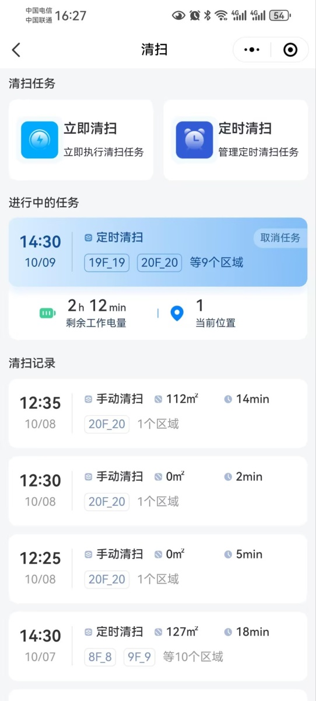

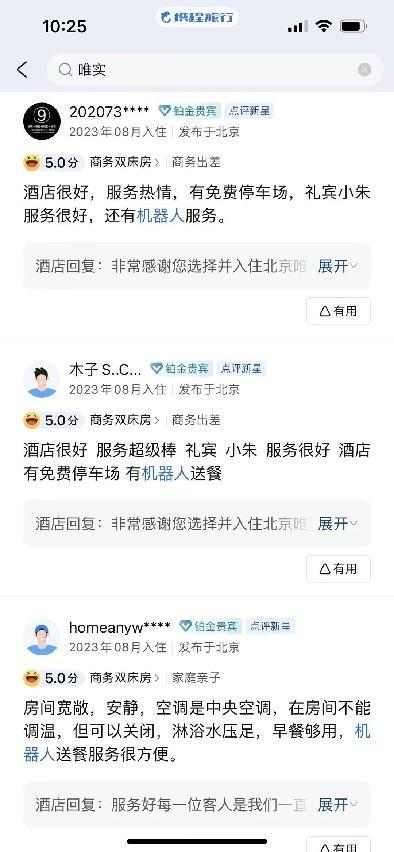

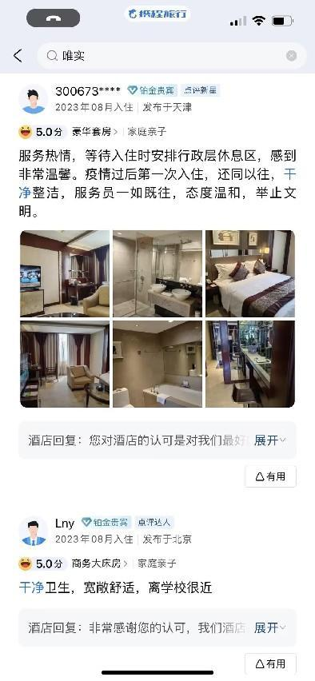

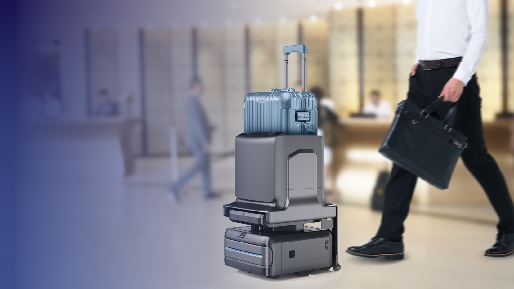

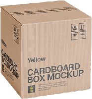

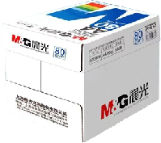

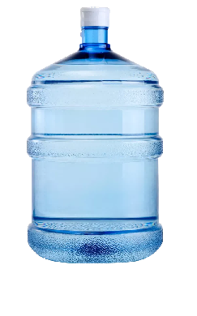

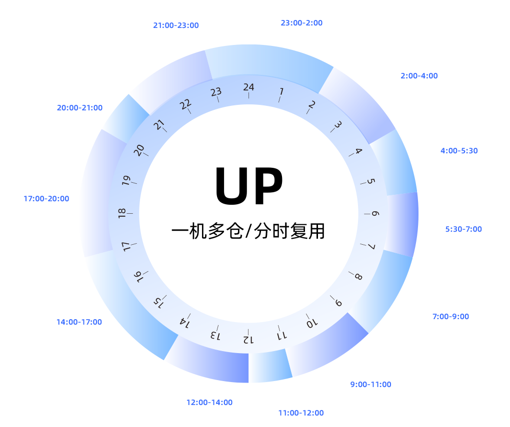

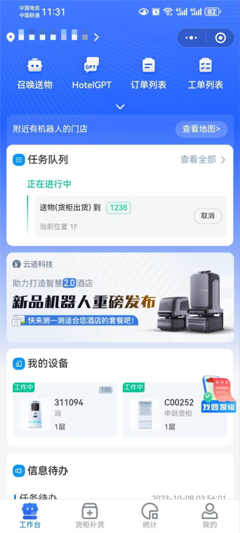

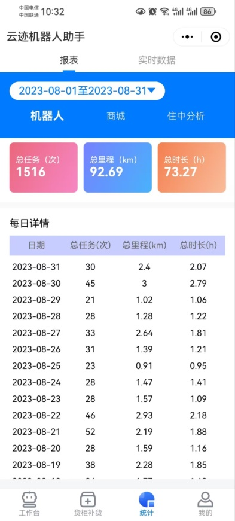

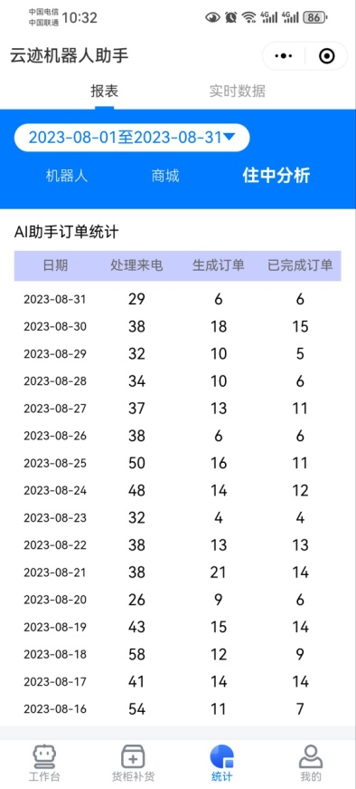

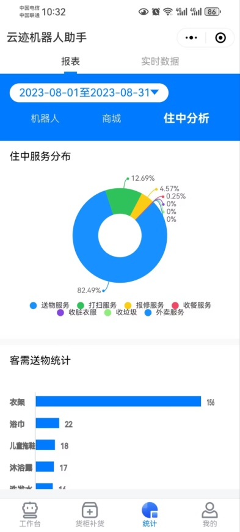

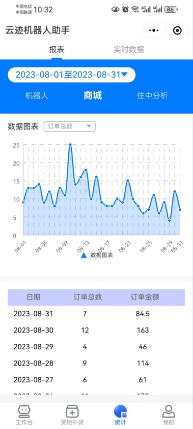

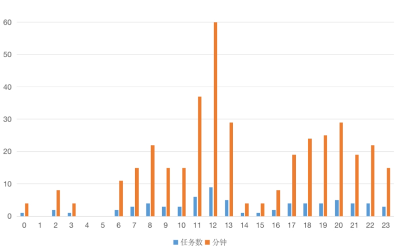

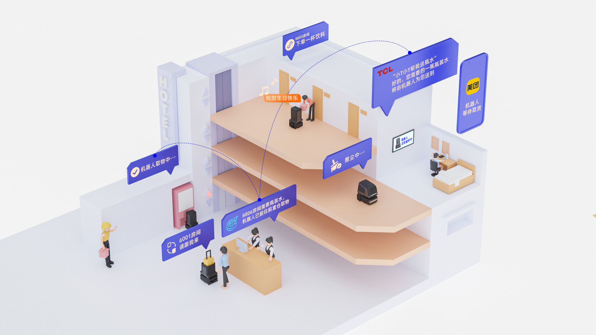

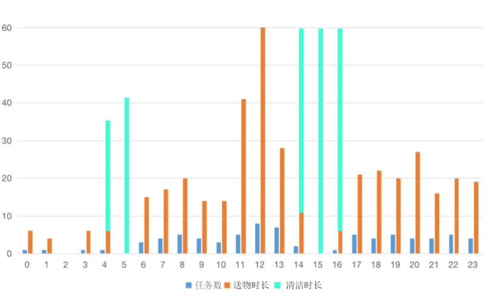

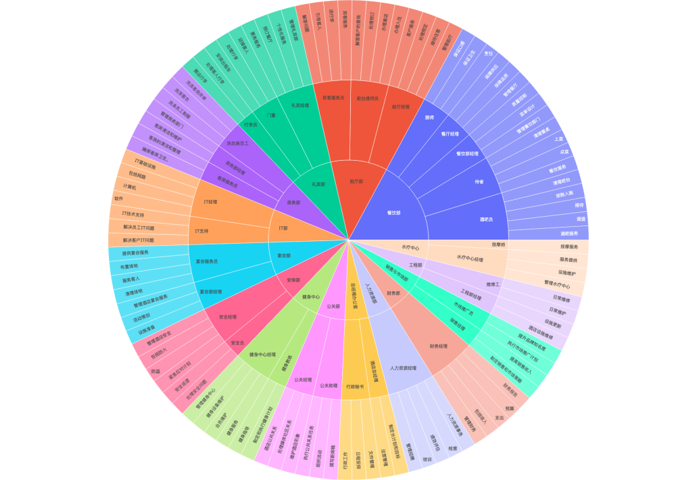

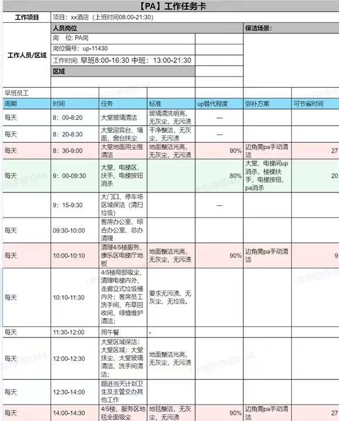

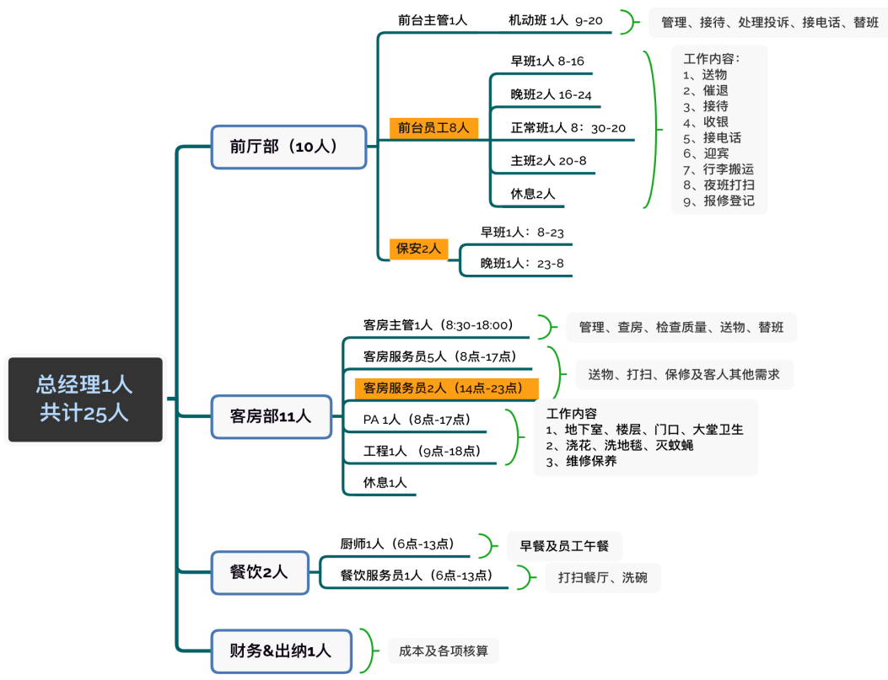

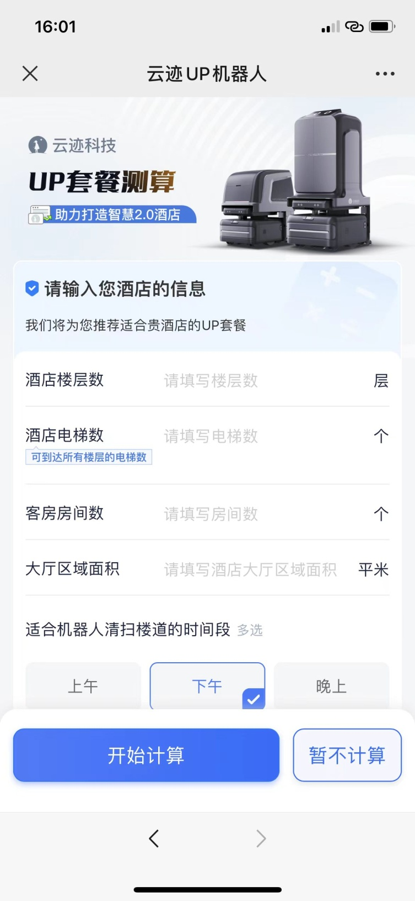

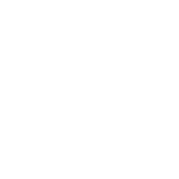

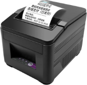

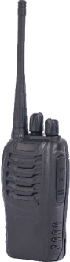

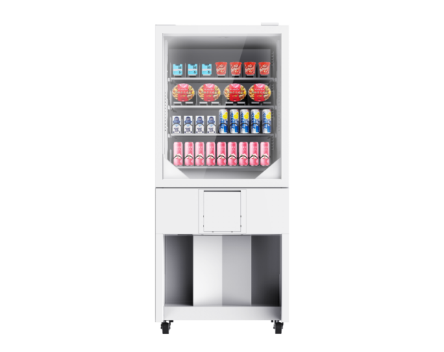

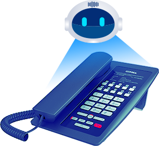

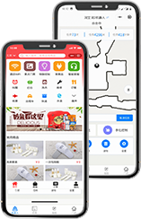


## 视频（未纳入仓库）

<!-- 视频文件（未复制）: `up清扫配送机器人.MOV` -->

<!-- 视频文件（未复制）: `格格酒店配送机器人.MOV` -->

